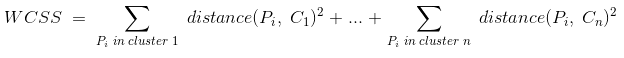
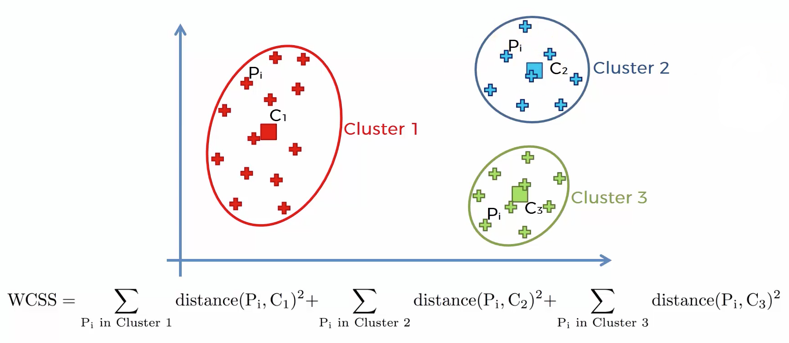
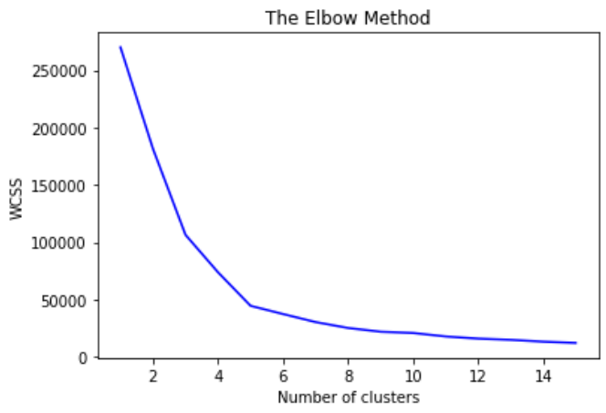
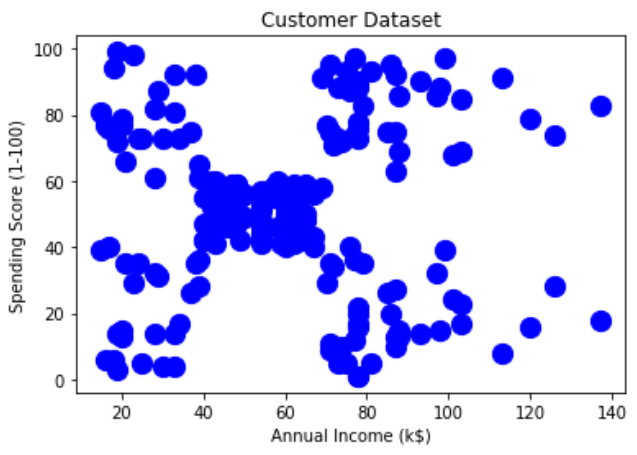
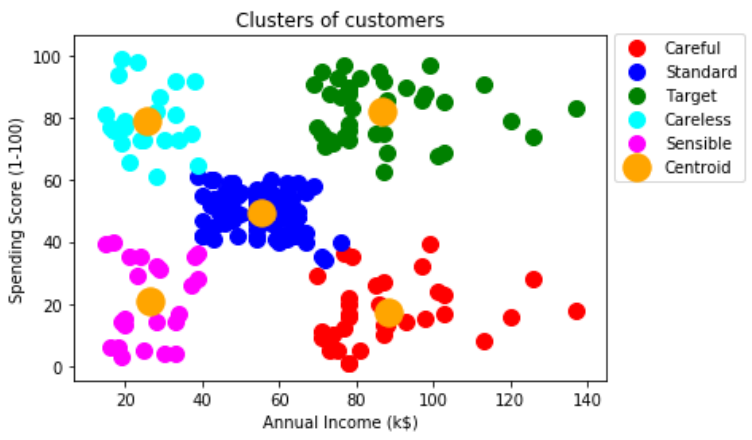

# Customer Marketing Segmentation

**Task:** We are currently working for the marketing department of a mall and have received data of the employees of the mall; this includes their salary and spending score at the mall due to staff discount. To increase subsidies further, we are tasked to cluster employees into segments so we can enroll each segment into a tailored loyalty scheme that better meets their requirements.

We will be completing this business task using clustering: K-Means and Hierarchical

## Clustering

When tasked to cluster we don't know the end result and are attempting to identify segments/clusters in the observed data. When we use clustering algorithms on the dataset, unexpected things can occur such as structures, clusters and groupings we could not visualise previously. 

## K-Means Clustering

The diagram below illustrates the impact of using K-Means on a dataset to cluster. We observe three clusters being optimal for the dataset.


## The Elbow Method

When using K-Means clustering, we must find the optimal number of clusters to use. The greater the number of clusters, the smaller the "Within Cluster Sum of Squares" or "WCSS", the better the goodness of fit.

**Within Cluster Sum of Squares**

WCSS is the sum of the square of the distances between the points and the centroid of the cluster. The formula is given below.



The diagram below illustrates the WCSS graphically.



For the dataset currently under study, we will be using the elbow method by computing the WCSS and visualise our findings graphically. We are visually searching for the "elbow", which is the point that can be loosely defined as the point where the WCSS plateaus or the decrease in WCSS stabilises.

**Tip**

If you are unable to visually see the elbow and determine the optimal number of clusters, try increasing the range of clusters. This should make the WCSS plateau more apparent for higher certainty when determining the elbow, thus finding the optimal number of clusters. 

The below code is used for computing the WCSS for a cluster range of 1-15 inclusively.

```
from sklearn.cluster import KMeans
wcss = []
for i in range(1,16):
    kmeans = KMeans(n_clusters = i, init = 'k-means++', n_init = 10, max_iter = 300, random_state = 0)
    kmeans.fit(X)
    wcss.append(kmeans.inertia_)
plt.plot(range(1,16), wcss, c='blue')
plt.title('The Elbow Method')
plt.xlabel('Number of clusters')
plt.ylabel('WCSS')
plt.show()
```

**Note**
- init = 'k-means++' refers to the "Random Initialisation Method" of the "K-Means ++" algorithm.
- max_iter = 300 refers to the maximum number of iterations to find the final clusters when the K-Means algorithm is running, the default value for max_iter = 300.
- n_init = 10 refers to the number of times the K-Means algorithm will be run with different initial centroids, the default value for n_init = 10.

The diagram below shows the graphical output of the above code, we observe the elbow at Number of Clusters = 5.



**Steps to performing the K-Means Clustering**

- **Step 1:** Choose the number k of clusters
- **Step 2:** Select at random n points to be the centroids of the clusters
- **Step 3:** Assign each data point to the closest centroid which will form k clusters
- **Step 4:** Compute and place the new centroid of each cluster
- **Step 5:** Reassign each data point to the new closest centroid. If any reassignment took place, go to step 4, otherwise we are finished.

**Random Initialisation Trap**

Our initial selection of the centroids at the beginning of the algorithm may dictate the outcome of the algorithm. In this case, we use the "K-Means ++" algorithm.

**Note**

K-Means ++ happens in the background of our machine learning algorithm automatically.

**Pros of K-Means Clustering**

- Simple to understand
- Easily adaptable
- Works well on small or large datasets
- Fast, efficient and performant

**Cons of K-Means Clustering**

- Need to choose the number of clusters




