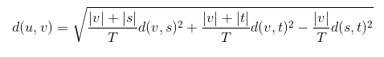
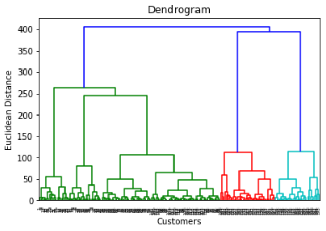
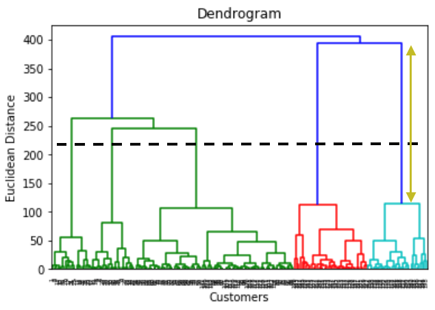
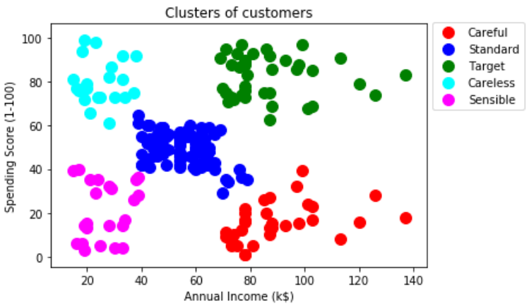

# Customer Marketing Segmentation

**Task:** We are currently working for the marketing department of a mall and have received data of the employees of the mall; this includes their salary and spending score at the mall due to staff discount. To increase subsidies further, we are tasked to cluster employees into segments so we can enroll each segment into a tailored loyalty scheme that better meets their requirements.

We will be completing this business task using clustering: K-Means and Hierarchical

## Clustering

When tasked to cluster we don't know the end result and are attempting to identify segments/clusters in the observed data. When we use clustering algorithms on the dataset, unexpected things can occur such as structures, clusters and groupings we could not visualise previously. 

## K-Means Clustering

The diagram below illustrates the impact of using K-Means on a dataset to cluster. We observe three clusters being optimal for the dataset.


## The Elbow Method

When using K-Means clustering, we must find the optimal number of clusters to use. The greater the number of clusters, the smaller the "Within Cluster Sum of Squares" or "WCSS", the better the goodness of fit.

**Within Cluster Sum of Squares**

WCSS is the sum of the square of the distances between the points and the centroid of the cluster. The formula is given below.


The diagram below illustrates the WCSS graphically.


For the dataset under our study, we will be using the elbow method by computing the WCSS and visualise our findings graphically. We are visually searching for the "elbow", which is the point that can be loosely defined as the point where the WCSS plateaus or the decrease in WCSS stabilises.

**Tip**

If you are unable to visually see the elbow and determine the optimal number of clusters, try increasing the range of clusters. This should make the WCSS plateau more apparent for higher certainty when determining the elbow, thus finding the optimal number of clusters. 

The below code is used for computing the WCSS for a cluster range of 1-15 inclusively.

```
from sklearn.cluster import KMeans
wcss = []
for i in range(1,16):
    kmeans = KMeans(n_clusters = i, init = 'k-means++', n_init = 10, max_iter = 300, random_state = 0)
    kmeans.fit(X)
    wcss.append(kmeans.inertia_)
plt.plot(range(1,16), wcss, c='blue')
plt.title('The Elbow Method')
plt.xlabel('Number of clusters')
plt.ylabel('WCSS')
plt.show()
```

**Note**
- init = 'k-means++' refers to the "Random Initialisation Method" of the "K-Means ++" algorithm.
- max_iter = 300 refers to the maximum number of iterations to find the final clusters when the K-Means algorithm is running, the default value for max_iter = 300.
- n_init = 10 refers to the number of times the K-Means algorithm will be run with different initial centroids, the default value for n_init = 10.

The diagram below shows the graphical output of the above code, we observe the elbow at Number of Clusters = 5.


**Steps to performing the K-Means Clustering**

- **Step 1:** Choose the number k of clusters.
- **Step 2:** Select at random k points to be the centroids of the clusters.
- **Step 3:** Assign each data point to the closest centroid which will form k clusters.
- **Step 4:** Compute and place the new centroid of each cluster.
- **Step 5:** Reassign each data point to the new closest centroid. If any reassignment took place, go to step 4, otherwise we are finished.

**Random Initialisation Trap**

Our initial selection of the centroids at the beginning of the algorithm may dictate the outcome of the algorithm. In this case, we use the "K-Means ++" algorithm.

**Note**

K-Means ++ happens in the background of our machine learning algorithm automatically.

**Pros of K-Means Clustering**

- Simple to understand
- Easily adaptable
- Works well on small or large datasets
- Fast, efficient and performant

**Cons of K-Means Clustering**

- Need to choose the number of clusters

The scatter plot below is a visualisation of our dataset under study.


After determining the optimal number of clusters being 5 from the elbow method, the diagram below is our clustered dataset. The key given beside the clustered visualisation can now be utilised in tailoring a loyalty scheme to each cluster.


## Hierarchical Clustering

There are two types of Hierarchical Clustering algorithms, they are "Agglomerative" and "Divisive" clustering. Agglomerative and Divisive clustering are also referred to as the "bottom up approach" and "starting from the top" respectively.

**Steps to performing the Agglomerative Hierarchical Clustering**

- **Step 1:** Make each data point a single-point cluster, therefore N datapoints resulting in N clusters.
- **Step 2:** Take the two closest data points (clusters) and make them one cluster, resulting in N-1 clusters.
- **Step 3:** Take the two closest clusters and make them one cluster, resulting in N-2 clusters.
- **Step 4:** Repeat step 3 until there is only one cluster.

The Hierarchical Clustering algorithm maintains a memory of how we went through the process. The memory is stored in a dendrogram.

## The Dendrogram

When using Agglomerative Clustering, the ideal or optimal number of clusters are found by using the dendrogram. The code given below is used to produce the dendrogram.

```
import scipy.cluster.hierarchy as sch
dendrogram = sch.dendrogram(sch.linkage(X, method = 'ward'))
plt.title('Dendrogram')
plt.xlabel('Customers')
plt.ylabel('Euclidean Distance')
plt.show()
```
With K-Means we use WCSS (Within Cluster Sum of Squares), but with Hierarchical Clustering we use "Within Cluster Variance". In the above code, method='ward' uses the "Ward variance minimization algorithm". The distance or new entry is given by the formula below, also known as the "Incremental Algorithm".



Where:

- "u" is the newly joined cluster consisting of clusters "s" and "t"
- "v" is an unused cluster in the forest
- T = |v| + |s| + |t|
- |~| is the cardinality of its argument

The diagram below shows the dendrogram produced by the above code.



**Pros of Hierarchical Clustering**

- The optimal number of clusters can be obtained by the model itself.
- Practical visualisation with the dendrogram.

**Cons of Hierarchical Clustering**

- Not appropriate on large datasets.

To determine the optimal number of clusters using a dendrogram, we set distance thresholds. For instance, we can set a threshold by not allowing the dissimilarities to go beyond a set distance X. Once we have set a threshold, we go horizontally across and see how many vertical lines cross paths with this horizontal line. The amount of interceptions will equate to the number of clusters we will select for our dataset. A common practice is to look for the longest vertical line that does not intercept the horizontal Euclidean distance bars if extended horizontally.

The diagram below illustrates this, with the longest distance highlighted by the golden arrow, and the dotted horizontal line intercepting this vertical line. As we observe the dotted line intercepting 5 vertical lines fro the euclidean distances, we state that our optimal number of clusters for the dataset is 5 clusters, in agreement with the elbow method.



Determining the optimal number of clusters to be 5 from the dendrogram, the diagram below is our clustered dataset. The key given beside the clustered visualisation can now be utilised in tailoring a loyalty scheme to each cluster.




